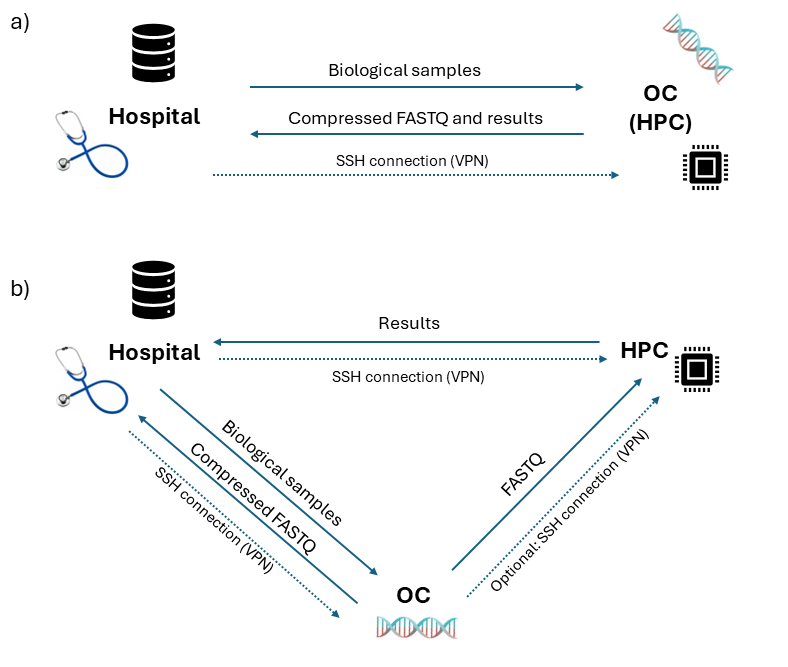
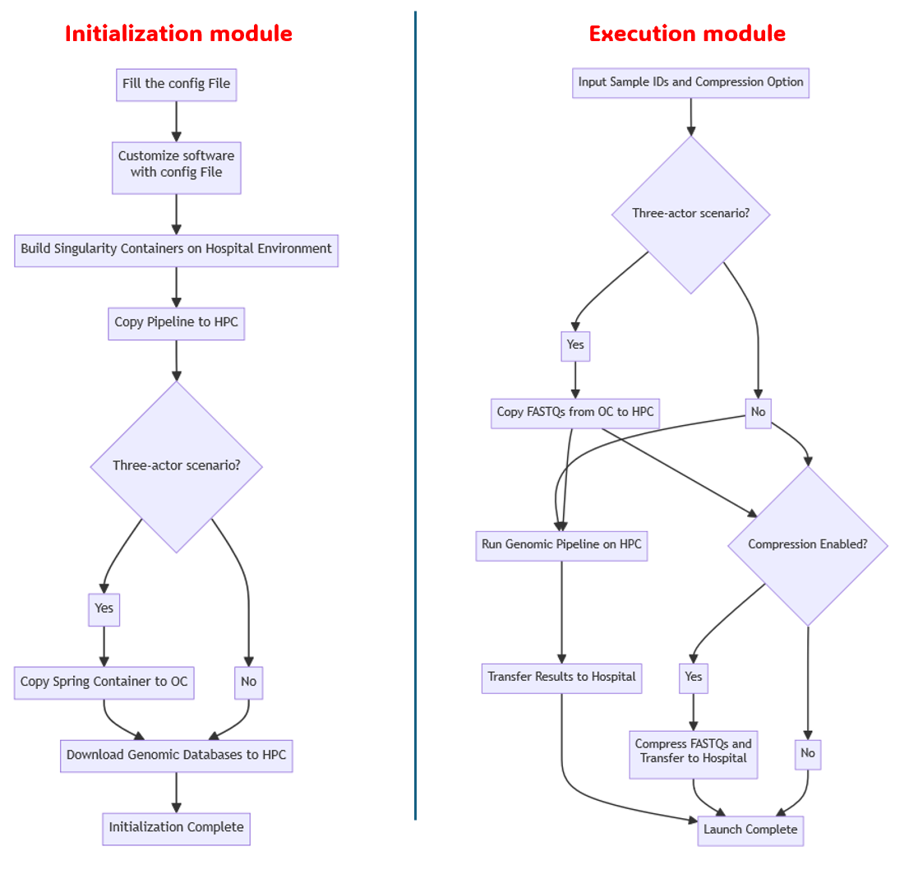

# VariantsStream

VariantsStream combines the existing and tested variant calling [pipeline]() developed by CMP3 VdA with the workflow managment system [Streamflow](https://streamflow.di.unito.it/) and a state-of-the-art FASTQ compressor, [Spring](https://github.com/shubhamchandak94/Spring). The resulting tool enables a clinician to initialize and launch a variant calling process from his local computer seamlessly.

In the context of genomic analysis, real world cases involve three different actors: a hospital, that requested the analysis; an Omic Center (OC), a lab specialized in high-precision molecular and genomic analysis, and a High-Performance computer (HPC), an environment with the computational resources (expecially GPUs) required to run variant calling pipelines.

We have developed VariantsStream to cover two distinct operative scenarios to perform seamlessly genomic analysis starting with FASTQ files. Those two scenarios are distinguished by the HPC availability in the sites (see the figure below):
1)	Two actors scenarios: the OC storage system concides with the HPC, in which case the pipeline runs on the Omic Center’s HPC: the two actors are the user’s hospital-client computer and the Omic Center (OC) HPC. In this scenario, we assume that the FASTQ files are already stored on the HPC and they do not have to be moved. 
2)	Three actors scenario: the OC takes advantage of a remote HPC system and the software must move the FASTQ from the OC’s storage to the HPC where the pipeline runs.




*Figure 1: Operative scenarios covered by VariantsStream.*

We assume the existence of an ssh connection between the hospital-client computer and each of the other environments: an ssh connection that directly connects the OC and the HPC is useful to speed up the execution, but is not mandatory.

## Modules
The software includes two modules: the *initialization module* is responsible for installing the tool on the different sites involved, the *execution module* executes the variant calling pipeline and the compression step.



*Figure 2: Software modules: the initialization module sets up the environment, the execution module handles the actual operations of the software.*

### Initialization Module
 
The initialization module performs the following key steps:
 
1. **Configuration Processing**: Parses  user configurations from `config_user.txt` to costumize the software.

2. **Environment Setup**: Prepares the local, HPC, and (if applicable) OC environments.

3. **Container Management**: Builds and distributes Singularity containers on the different sites involved.

4. **Database Preparation**: Downloads and indexes necessary genomic databases on the HPC.
 


### Execution Module

The execution module performs the genomic analysis as follows:
 
1. **Compression**: If the compression option is enabled, the FASTQ files are compressed and pulled back on the hospital-client computer.

2. **Variant Calling**:  if the HPC and the OC storage do not coincide, the FASTQs are copied to the HPC and subsequently processed with the variant calling pipeline.

3. **Results retrival**: The results of the pipeline are pulled back on the hospital-client and the temporary files produced on the HPC are deleted.


# Usage
All the commands executed by the user are launched on the hospital-client computer: the user does not have to manual log in any of the other environments.
## Prerequisites

Install streamflow:
```
pip install "streamflow==0.2.0.dev11"
```
If you do not already have them, create ssh-key pairs between: your local PC (hospital-client) and the HPC; your local PC (hospital-client) and the OC storage (if in the three-actors scenario). From the client, use (and adapt) the following commands
```
ssh-keygen -t rsa -b 4096
```
Press Enter to accept the default name and to leave the passphrase empty. Upon modifying the username and hostname, use the command

```
ssh-copy-id -i ~/.ssh/id_rsa.pub username@hostname
```
to copy the key on the other environments.


## Initialization
We initialize the software on each of the actors involved from the user's PC using Streamflow (the initialization pipeline is located in the folder */Pipeline_init*).

Download the project on your local PC and name it *VariantsStream*:
```
git clone https://gitlab.iit.it/Sami.Rawash/streamflow_vc VariantsStream
```
and insert the username and password (git-key). Move into the root of the project.

The initialization module is located in *./Pipeline_init*. First, the user shall costumize the *./Pipeline_init/config_user.txt* file (see the next section for a guide on the *config_user.txt* file).
Next, one has to download the COSMIC database following [this guide](https://cancer.sanger.ac.uk/cosmic/archive-download ): register to the website and download the file *CosmicCodingMuts.vcf.gz*. Create the folder *./Pipeline/CMP3_germline/bin/resource/cosmic/* and copy the *CosmicCodingMuts.vcf.gz* file there.
Run the script
```
python3 ./Pipeline_init/init_pipeline_local.py
```
to costumize the software with the information in the *config_user.txt* file.
To complete installation, run the intialization streamflow script as follows:
```
streamflow run ./Pipeline_init/streaflow.yml
```
The user is asked to prompt the sudo password on the hospital-client to build the Singularity containers (prompting the password might be required several times if the time taken by Singularity to build the containers is longer the expiration time of sudo priviledges). After copying the containers on the relevant sites, streamflow schedules the download of the genomic databases on the HPC and terminates. Upon completion of this job the user is notified by email. The user receives an email error message if the process terminates with errors (e.g. due to server connection problems). In case of error one can launch the Streamflow command again: it will resume from the point of interruption and continue. 


## Config file
The initialization process requires the user to fill a configuration file. The configuration file includes:
1. **Software settings**:  the user choices between two and three actors scenario, compression of the FASTQ, etc.

2. **User’s and client related information**:  e.g. email, username, local path to the directory where the results should be retrived.

3. **Technical information on the HPC and OC environments**: ostname, queue names, etc.

The fill shall be filled according to the following documentation:

- **three_actors**: can take values 'true' or 'false', depending on whether the software should be configured according to the first or second scenario.
- **move_fastqs**: can take values 'true' or 'false', this parameter enables (or disables) the compression of FASTQ file. 
- **ssh_oc_hpc**: can take values 'true' or 'false', depending on whether there exists a direct ssh key connection between the HPC and the OC.
- **hpc_username**: User's username on the HPC system.
- **hpc_output_dir**: HPC's directory where results will be temporary stored.
- **project_name**: Input the name of the project for PBS tracking purposes.
- **email**: Provide your email address for notification purposes.
- **hpc_work_dir**: Define the working directory on the HPC system. This is the directory where the Pipeline will be installed.
- **hpc_fastqs_folder**: If we are in the 2 actors scenario this is the HPC's folder containing FASTQ files. If we are in the 3 actors scenario, this will be the HPC directory where the input FASTQ files are temporary stored to run the genomic pipeline.
- **parabricks_version**: String, that can take values "4.0" or "4.1". Sets Parabricks' version: note that Parabricks 4.1 requires gpu a100.
- **hpc_queue_parabricks**: Defines the HPC queue to be used to execute Parabricks.

- **hpc_hostname**: Enter the hostname of the HPC system.
- **conda_module**: HPC Conda module for environment management. This is used to create the Nextflow environment.
- **singularity_module**: Input the name of the Singularity module on the HPC.
- **HPC_queue**: Define the HPC queue for job submission (used for all the processes but Parabricks).


If **three_actors**='true', the user shall include information on the OC storage, in particular: 
- **oc_username**: User's username on the OC storage.
- **oc_hostname**: Hostname of the OC environment.
- **oc_work_dir**: Specify the working directory on the OC.
- **oc_fastq_dir**: Enter the directory that contains the FASTQ files to be analysed.

Even if one is setting the software for the three actors scenario, the parameters relevant for the OC storage shall not be erased: assign them an empty string value.


## Execution of the pipeline

Once VariantsStream is initialized, the user can execute the genomic pipeline to analyse FASTQ files. 
First, one has to specify the IDs of the samples to be process: this is done by passing to the python script *./Pipeline/pass_samples.py* the comma separated list of IDs to be analysed:
```
python ./Pipeline/pass_samples.py sample1,sample2,sample3
```


Note that the left and right FASTQ files should be named following this convention:
 **STRING_STRING_(SAMPLE_ID)_STRING_R{1,2}_001.fastq.gz**
where 'STRING' is a generic string, and 'SAMPLE_ID' is the identifier of the sample.

For example, if the left and right FASTQ files containing the sequencing of a sample are named 'ProjName_HospName_sample1_R1_001.fastq.gz' and 'ProjName_HospName_sample1_R2_001.fastq.gz' respectively, one passes this sample to the pipeline via:
```
python ./Pipeline/pass_samples.py sample1
```

To launch the genomic pipeline, there are two different commands, depending on whether the software is initialized for the two or three actors scenario. 
If **three_actors**='true', run the pipeline via:
```
streamflow run ./Pipeline/streamflow.yml
```
If the initialization involves the two-actors scenario:
```
streamflow run ./Pipeline/streamflow_2act.yml
```


## Output
When the pipeline terminates, the user can find the genomic analysis results in *./Pipeline/results_\$SAMPLE_IDs*, while the compressed FASTQ files are retrived in *./Pipeline/compressed_\$SAMPLE_IDs*.
 
## License
 
VariantsStream is released under the [GNU General Public License v3.0](LICENSE).
 
## Citation
 
If you use VariantsStream in your research, please cite our paper:
 
[Paper citation to be added upon publication]
 
